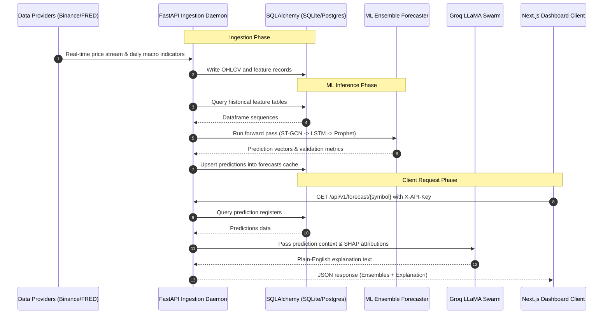

# Architecture Specification

This document details the system design, component mapping, data flow, and technology choices for the Crypto Ensemble Forecaster Platform.

---

## 1. System Diagram

Below is the high-level architecture diagram illustrating the integration between the external data sources, the ML pipeline, the storage layer, the API backend, and the interactive frontend.

```text
+---------------------------------------------------------------------------------+
|                               EXTERNAL DATA SOURCES                             |
|                                                                                 |
|  +-------------------+       +--------------------+      +-------------------+  |
|  | Binance WebSocket |       | FRED Macro API     |      | CoinGecko API     |  |
|  +---------+---------+       +---------+----------+      +---------+---------+  |
|            |                           |                           |            |
+------------|---------------------------|---------------------------|------------+
             | (Real-time Ticker)        | (Daily Ingestion)         | (Sentiment Data)
             v                           v                           v
+---------------------------------------------------------------------------------+
|                               BACKEND SERVICES                                  |
|                                                                                 |
|  +---------------------------------------------------------------------------+  |
|  |                           FastAPI Core Server                             |  |
|  |                                                                           |  |
|  |   +-----------------------+                    +-----------------------+  |  |
|  |   |   Binance WS Loop     |                    |   APScheduler Tasks   |  |  |
|  |   +-----------+-----------+                    +-----------+-----------+  |  |
|  |               | (Cache Updates)                            |              |  |
|  |               v                                            v              |  |
|  |      [In-Memory Cache] <------------------------- [ETL & Inference Run]   |  |
|  |               ^                                            | (DB Write)   |  |
|  |               | (REST Read)                                v              |  |
|  |   +-----------+-----------+                    +-----------+-----------+  |  |
|  |   |   API Route Handlers  |                    |      SQLAlchemy       |  |  |
|  |   +-----------+-----------+                    +-----------+-----------+  |  |
|  |               | (X-API-Key Secured)                        | (SQL Dialect)|  |
|  +---------------|--------------------------------------------|---------------+  |
|                  |                                            |                  |
|                  |                                            v                  |
|  +---------------|--------------------------------------------|---------------+  |
|  |               |                                            |               |  |
|  |               |                  DATABASE                  |               |  |
|  |               |                                            |               |  |
|  |               |            +-------------------+           |               |  |
|  |               |            |   Local SQLite    |<----------+               |  |
|  |               |            | (cryptograph.db)  | (Dev Mode)                |  |
|  |               |            +-------------------+                           |  |
|  |               |                                                            |  |
|  |               |            +-------------------+                           |  |
|  |               |            | Supabase Postgres |<----------+               |  |
|  |               |            |  (DATABASE_URL)   | (Prod Mode)               |  |
|  |               |            +-------------------+                           |  |
|  |               |                                                            |  |
|  +---------------|------------------------------------------------------------+  |
|                  | (Secure JSON over REST / WS)                                  |
+------------------|---------------------------------------------------------------+
                   |
                   v
+---------------------------------------------------------------------------------+
|                                 CLIENT LAYER                                    |
|                                                                                 |
|  +---------------------------------------------------------------------------+  |
|  |                         Next.js 14 Dashboard App                          |  |
|  |                                                                           |  |
|  |     - Authenticates REST/WS queries using header X-API-Key.               |  |
|  |     - Visualizes real-time tickers, ensembles, and consensus metrics.      |  |
|  |     - Interactive correlation graphs & simulated paper-trading client.    |  |
|  +---------------------------------------------------------------------------+  |
+---------------------------------------------------------------------------------+
```

---

## 2. Service Map

The topography of services shows where components run and how they interact:

```text
                      +---------------------------------------+
                      |         Frontend (Next.js 14)         |
                      |  Host: Vercel / Local Host            |
                      +-------------------+-------------------+
                                          |
                                          | (Fetch REST & WS Streams)
                                          | (X-API-Key Header Auth)
                                          v
                      +---------------------------------------+
                      |            Backend (FastAPI)          |
                      |  Host: Render / Local Uvicorn         |
                      +-------+-----------------------+-------+
                              |                       |
        (Query DB via SQL)    |                       | (LangChain Prompting)
                              v                       v
            +-----------------+-----------------+  +--+--------------------+
            |           SQLAlchemy              |  |      Groq Cloud       |
            |     (SQLite OR Postgres)          |  | (Llama 3.3 70B Model) |
            +--------+--------------------+-----+  +-----------------------+
                     |                    |
        (Dev Mode)   |                    | (Prod Mode)
                     v                    v
            +--------+-------+   +--------+-------+
            |  Local SQLite  |   |  Supabase DB   |
            |  (File Storage)|   |  (PostgreSQL)  |
            +----------------+   +----------------+
```

* **Frontend (Next.js 14):** Served via Vercel or locally. Communicates exclusively with the FastAPI backend via Axios and WebSocket wrappers. Requires the `X-API-Key` configured in its environment.
* **Backend API (FastAPI):** Served via Dockerized containers or local uvicorn process. Manages WebSocket connections for client streams, provides JSON REST endpoints, and hosts the background APScheduler loop for automated ingestion.
* **Storage Layer (SQLAlchemy):** Abstraction layer enabling unified operations. Operates on a single-file SQLite database locally, or connects directly to remote PostgreSQL (e.g. Supabase DB) when a `DATABASE_URL` is set in the environment.
* **Groq Cloud:** LLM integration provider. Resolves plain-English analytics summaries by sending current prediction vectors and feature importance scores to LLaMA 3.3.

---

## 3. Data Flow



---

## 4. Technology Decisions Rationale

| Technology | Selected Stack | Rationale |
| :--- | :--- | :--- |
| **Database ORM** | **SQLAlchemy** | Decouples SQL code from vendor-specific engines. Enables developers to run standard, zero-dependency SQLite locally while maintaining full feature-compatibility with enterprise PostgreSQL (Supabase) in production. |
| **In-Memory Cache** | **Redis / TTLCache** | Implements a dual-mode cache strategy. Falls back to Python-native memory TTL caches locally to optimize boot-up speed, while supporting standard Redis pools for horizontal scale-out in production. |
| **LLM Inference** | **Groq Cloud (llama-3.3-70b-versatile)** | High-speed LLM inference provider. Translates model weight attributions into understandable trade rationale without adding user latency. |
| **WebSocket Core** | **FastAPI WebSockets** | Pipes real-time tick changes directly from Binance streams to the frontend dashboard. Prevents layout lag and database poll spam. |
| **Frontend UI** | **Next.js 14 (TS + Tailwind)** | Offers clean visual layouts, component optimization, and type-safety across interactive charts. |
