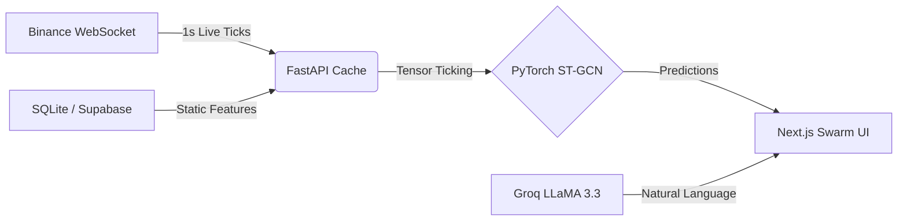

<div align="center">
  
  
  
  

  <h1>🧠 CryptoGraph Analytics</h1>
  <p><b>A Production-Grade Spatio-Temporal Graph Neural Network (ST-GCN) for Cryptocurrency Market Forecasting.</b></p>
  <p>Real-time data. Deep Learning predictions. Swarm Intelligence UI.</p>
</div>

<br />

## 🪐 What is this?
Welcome to **Project Swarm**. Traditional crypto trackers give you basic line charts. We give you a live **Neural Network**. 

CryptoGraph Analytics tracks 50 major crypto assets in real-time. Instead of evaluating them in isolation, it uses an **ST-GCN (Spatio-Temporal Graph Convolutional Network)** to treat the entire crypto market as a single living organism. If Ethereum moves, the network mathematically calculates how that shockwave ripples to DeFi tokens. 

We then pipe these neural predictions directly into a stunning, glassmorphism-heavy, 60fps React dashboard via native WebSockets.

---

## ✨ The Features

* **🕸️ Swarm Intelligence Map**: A live, spatial visualization of market clustering. Hover over any node to see the deep-learning technical matrix and directional confidence.
* **⚡ 1-Second WebSocket Sync**: Zero-latency price updates piped directly from Binance's WebSockets to the frontend.
* **🔮 Predictive Engine**: On-demand 7-day forecasting utilizing an ensemble of `LSTM` and `NeuralProphet`.
* **🤖 CIO Analyst Explanations**: Groq's `LLaMA 3.3 70B` acts as your Chief Investment Officer, reading the mathematical graph and explaining *why* the AI made a certain prediction.
* **🛡️ Fallback Resilience**: Delisted coin? Dead Binance node? The system intelligently falls back to local SQLite caching. No $0.00 balances, no crashed dashboards.

---

## 🚀 One-Click Deployments

We've engineered this project to be deployed flawlessly across any environment. Choose your weapon:

### 1. The "I just want it to work on my laptop" Deploy (Mac & Linux)
We wrote a native bash launcher. Just run this in your terminal. It sets up your paths, spawns the backend and frontend in the background, and opens your browser.
```bash
git clone https://github.com/AkshatJ557/CryptoGraph_Analytics.git
cd CryptoGraph_Analytics
chmod +x start.sh
./start.sh
```

### 2. The VPS / Production Deploy (Docker Compose)
Want to host this on a DigitalOcean droplet or AWS EC2? We have a unified `docker-compose.yml` that builds the PyTorch FastAPI backend and the Next.js Standalone frontend.
```bash
docker-compose up --build -d
```
*Note: Make sure Docker and Docker Compose are installed.*

### 3. The Serverless Deploy (Vercel & GitHub Actions)
The frontend is already configured for **Next.js Standalone Output**. 
1. Push this repository to your GitHub.
2. Connect it to **Vercel**.
3. It will deploy automatically.
4. *Bonus:* We included a GitHub Actions pipeline (`.github/workflows/docker-build.yml`) that automatically tests and builds your Docker images on every push to `main`!

### 4. The Mobile Native Deploy (Android & iOS)
We integrated **Capacitor** to easily compile the Next.js frontend into a native mobile application.
1. Configure your backend to be hosted on a cloud provider (so your mobile app can fetch data via the internet).
2. Update the `NEXT_PUBLIC_API_URL` in your frontend `.env` to point to your live backend.
3. Run the mobile export process:
```bash
cd frontend
npm install @capacitor/core @capacitor/cli @capacitor/ios @capacitor/android
npx cap init

# Build the Next.js app as a static HTML export
BUILD_MOBILE=true npm run build

# Add native platforms
npx cap add android
npx cap add ios

# Sync your web build to the native projects
npx cap sync

# Open Android Studio or XCode to build and sign the app!
npx cap open android
# OR
npx cap open ios
```

---

## 🛠️ Manual Hacker Setup

If you want to run the stack manually for active development, follow these steps:

### 1. The Environment
Copy the env templates and add your keys (Groq is required for the LLM explanations; the rest can run locally!).
```bash
cp backend/.env.example backend/.env
cp frontend/.env.example frontend/.env.local
```

### 2. The Backend (PyTorch & FastAPI)
```bash
cd backend
python -m venv venv
source venv/bin/activate  # Or `venv\Scripts\activate` on Windows
pip install -r requirements.txt

# Start the uvicorn server
python -m uvicorn app.main:app --host 0.0.0.0 --port 8000 --reload
```

### 3. The Frontend (Next.js)
Open a new terminal:
```bash
cd frontend
npm install
npm run dev
```
Visit `http://localhost:3000`

---

## 🏗️ Architecture Flow



---

## 🙋 Frequently Asked Questions

### Why do some coins just disappear from the Screener?
**Feature, not a bug.** Binance delists coins (like `WAVES` or `REN`), or regional restrictions block their WebSocket stream. Instead of breaking the UI with a `$0.0000` price and `0.0%` change, our backend actively filters dead nodes out of the Swarm Map. 

### Does it actually trade my money?
**No.** This is an Analytics and Forecasting dashboard. There is no wallet integration or automated execution. It tells you what the Neural Network *thinks* will happen. What you do with that information is up to you.

### I am getting "Failed to load market data" or "Stream Offline".
This happens if the backend isn't running, or if it's your very first time booting and the SQLite database is completely empty. Run the backend, let it establish the WebSocket handshake with Binance (takes about 5 seconds), and refresh the page.

### The UI is too heavy for my laptop.
The frontend uses heavy glassmorphism, dynamic blur renders, and WebGL charts. If you are experiencing frame drops, we recommend viewing the dashboard on a machine with a dedicated GPU or a modern Apple Silicon chip.

---
<div align="center">
  <p>Built with 🩵 by the ST-GCN Analytics Team.</p>
</div>
