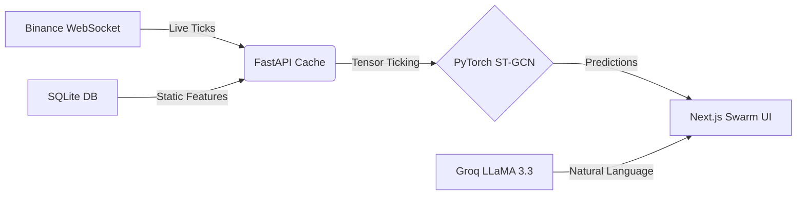

<div align="center">
  
  
  
  

  <p><b>An Experimental Research & Analytics Platform using Spatio-Temporal Graph Neural Networks (ST-GCN) for Cryptocurrency Market Analysis.</b></p>
</div>

<br />

## 🪐 What is this?
Welcome to **Project Swarm**. CryptoGraph Analytics tracks 50 major crypto assets, evaluating them using an **ST-GCN (Spatio-Temporal Graph Convolutional Network)** to treat the crypto market as a single interconnected system.

These neural predictions are piped into a React dashboard via WebSockets.

---

## ✨ Core Features

* **🕸️ Swarm Map**: A spatial visualization of market clustering showing directional confidence.
* **⚡ Live WebSocket Sync**: Fast price updates piped from Binance's WebSockets to the frontend.
* **🔮 Predictive Engine**: On-demand forecasting utilizing an ensemble of `LSTM` and `NeuralProphet`.
* **🤖 CIO Analyst Explanations**: Groq's `LLaMA 3.3 70B` acts as an analyst, reading the graph and explaining the AI's prediction (includes deterministic fallback if API is unavailable).
* **🛡️ Fallback Resilience**: If Binance WebSocket disconnects, the system gracefully falls back to CoinGecko REST endpoints and local SQLite caching.

---

## 🚀 Deployment (Docker Compose)

The canonical, supported way to deploy CryptoGraph Analytics is via **Docker Compose**. The entire stack (Backend API, Frontend Dashboard, and local SQLite database) runs inside unified containers.

### Requirements
- Docker and Docker Compose
- Minimum 4GB RAM (Intel i3 / Equivalent or higher)

### Setup Steps
1. Clone the repository:
   ```bash
   git clone https://github.com/PriyanshGadia/CryptoGraph_Analytics.git
   cd CryptoGraph_Analytics
   ```

2. Configure your Environment Variables (see table below).
   ```bash
   cp backend/.env.example backend/.env
   cp frontend/.env.example frontend/.env.local
   ```

3. Launch the stack:
   ```bash
   docker-compose up --build -d
   ```
   The frontend will be available at `http://localhost:3000` and the backend API at `http://localhost:8000`.

---

## ⚙️ Environment Variables

### Backend (`backend/.env`)
| Variable | Description | Required | Default |
|----------|-------------|----------|---------|
| `ENVIRONMENT` | Operating mode (`development` or `production`) | Yes | `development` |
| `API_KEY` | Secret key required to access `/api/*` endpoints | Yes | None |
| `FRONTEND_URL` | The URL of the frontend (for CORS and security) | Yes | `http://localhost:3000` |
| `GROQ_API_KEY` | API key for the CIO Analyst LLaMA 3.3 model | No | None (uses local fallback) |

### Frontend (`frontend/.env.local`)
| Variable | Description | Required | Default |
|----------|-------------|----------|---------|
| `NEXT_PUBLIC_API_URL` | URL of the FastAPI Backend | Yes | `http://localhost:8000` |
| `NEXT_PUBLIC_API_KEY` | Secret key matching the Backend `API_KEY` | Yes | None |

---

## 🏗️ Architecture Flow



---

## 🙋 Frequently Asked Questions

### Why do some coins just disappear from the Screener?
Binance delists coins, or regional restrictions block their WebSocket stream. Instead of breaking the UI with a `$0.0000` price, our backend actively filters dead nodes out of the Swarm Map. 

### Does it actually trade my money?
**No.** This is an Analytics and Forecasting dashboard. The portfolio dashboard shows simulated backtested runs and paper trading. There is no automated execution.

### How are the model validation metrics calculated?
Validation metrics (F1 validation score, Sharpe ratio) are computed chronologically on a held-out validation set. If a model's F1 score is below 0.35 or Sharpe is below 0.0, the inference pipeline gates predictions and serves a "recalibrating" state to the UI to avoid outputting poor predictions.

### I am getting "Failed to load market data" or "Stream Offline".
This happens if the backend isn't running, or if it's your very first time booting and the SQLite database is completely empty. Ensure Docker Compose is healthy, and the `API_KEY` matches between frontend and backend.

---
<div align="center">
  <p>Built with 🩵 by the ST-GCN Analytics Team.</p>
</div>
