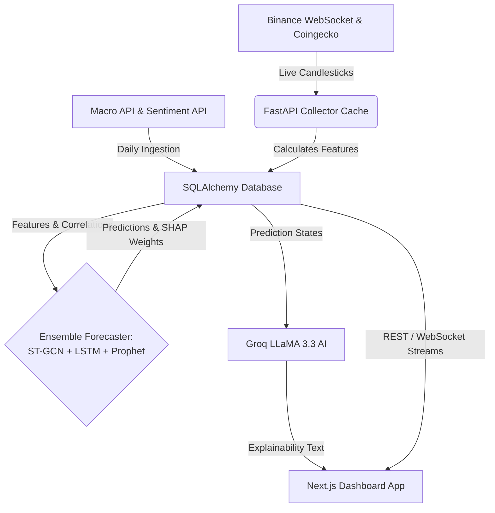

<div align="center">
  
  
  
  

  <p><b>An Experimental Research & Analytics Platform using Ensemble Machine Learning for Cryptocurrency Market Analysis.</b></p>
</div>

<br />

## 🪐 Project Overview

**CryptoGraph Analytics** is a data-science research and analytics platform designed to model and forecast cryptocurrency price actions, volatility regimes, and correlation networks. The system tracks 49 major crypto assets, engineering live technical features and feeding them to an **Ensemble Forecasting Pipeline** comprising a flagship Spatio-Temporal Graph Convolutional Network (ST-GCN), a Long Short-Term Memory (LSTM) model, and Facebook's NeuralProphet. 

Predictions are analyzed by a Mixture-of-Agents (MoA) trading swarm, contextualized in plain English via LLM explanation blocks (Groq LLaMA 3.3), and streamed to a Next.js frontend dashboard via real-time WebSockets.

---

## ⚙️ Architecture & Deployment Modes

The system is architected to run in two distinct deployment configurations, balancing developer portability with production scale-out capacity.

> [!IMPORTANT]
> **Database Abstraction Note:** While `requirements.txt` contains Supabase clients, the backend interacts with the database exclusively through **SQLAlchemy**. This design allows you to transition seamlessly between local SQLite and remote PostgreSQL (such as Supabase DB) simply by swapping environment variables. The frontend *does not* talk to Supabase directly; it queries the FastAPI backend using custom headers, ensuring a strict Single Source of Truth (SSOT).

### 1. Simple / Local Development Mode (SQLite)
* **Storage:** A local `cryptograph.db` file managed via SQLAlchemy.
* **Concurrency:** SQLite runs in **WAL (Write-Ahead Logging)** mode with `synchronous=NORMAL` and a `64MB` cache. This enables the server to process real-time WebSocket tick writes while serving API reads without database locking.
* **Caching:** In-memory caching using a `TTLCache` (no external caching server required).
* **Resource Footprint:** Very low (<3GB RAM). Ideal for local development, tests, and low-resource environments.

### 2. Production / Scale-Out Mode (Supabase Postgres + Redis)
* **Storage:** PostgreSQL database (hosted via **Supabase** or any standard cloud instance) connected via `DATABASE_URL`.
* **Caching:** Distributed caching using a **Redis** cluster connected via `REDIS_URL` to support multiple application instances.
* **Monitoring:** Application exception reporting via **Sentry** (`SENTRY_DSN`).
* **Metrics & Tracing:** Auto-instrumentation using **Prometheus** (`prometheus-fastapi-instrumentator`) and **OpenTelemetry** APM wrappers.

---

## 🚀 Step-by-Step Setup

### Option A: Local SQLite Launch (Quickstart)

The simplest way to run the entire stack is using Docker Compose.

1. Clone and enter the repository:
   ```bash
   git clone https://github.com/PriyanshGadia/CryptoGraph_Analytics.git
   cd CryptoGraph_Analytics
   ```
2. Copy environment files:
   ```bash
   cp backend/.env.example backend/.env
   cp frontend/.env.example frontend/.env.local
   ```
3. Set your custom `API_KEY` (must match in both `.env` and `.env.local` files).
4. Run the containers:
   ```bash
   docker-compose up --build -d
   ```
   The SQLite file `cryptograph.db` will be initialized in the workspace, and the frontend will be available at `http://localhost:3000`.

### Option B: Production Supabase + Redis Setup

To scale the platform out, deploy the backend to a cloud host (like Render or fly.io) and connect external database/caching systems.

1. **Supabase Database:** Spin up a Supabase project. Copy the PostgreSQL connection URI under Database Settings and set it as `DATABASE_URL` in the backend configuration.
2. **Redis Cache:** Spin up a Redis instance and set the connection URI as `REDIS_URL` in the backend configuration.
3. **Sentry Error Tracking:** Set the `SENTRY_DSN` variable in your production env.
4. **Launch the stack:** Run migrations via Alembic or let the startup script populate schemas:
   ```bash
   docker-compose -f docker-compose.prod.yml up --build -d
   ```

---

## ⚙️ Environment Configurations

### Backend (`backend/.env`)
| Variable | Required | Default | Description |
| :--- | :--- | :--- | :--- |
| `API_KEY` | **Yes** | None | Secret key used to authorize frontend API queries. Must be URL-safe & >=32 chars. |
| `ENVIRONMENT` | Yes | `development` | Set to `production` in live environments. |
| `DATABASE_URL` | No | None | PostgreSQL connection string. If omitted, falls back to local `cryptograph.db` SQLite file. |
| `REDIS_URL` | No | None | Redis connection string for caching. If omitted, falls back to in-memory TTL caching. |
| `SENTRY_DSN` | No | None | Sentry client integration DSN. |
| `GROQ_API_KEY` | No | None | API Key for LLaMA 3.3. If omitted, explainability routes return a deterministic math summary. |

### Frontend (`frontend/.env.local`)
| Variable | Required | Default | Description |
| :--- | :--- | :--- | :--- |
| `NEXT_PUBLIC_API_URL` | **Yes** | `http://localhost:8000` | Address of the FastAPI backend. |
| `NEXT_PUBLIC_API_KEY` | **Yes** | None | Must match the backend's `API_KEY`. Used in the `X-API-Key` headers. |

---

## 🔮 How It Works



1. **Ingestion:** A background daemon connects to Binance WebSockets to stream live trades. Macroeconomic indexes (FRED) and community indexes (Fear & Greed) are ingested daily.
2. **Feature Store:** Technical indicators (RSI, MACD, Bollinger Bands, Volatility) are computed and committed to the database.
3. **ML Inference:** When predictions are requested, the backend loads pre-trained model weights. Feature signals pass through the ST-GCN spatial correlator, the direct multi-step LSTM model, and Prophet temporal patterns to generate a consensus forecast.
4. **Validation Gating:** If a model's F1 validation score drops below `0.35` or Sharpe ratio drops below `0.0`, the pipeline flags the model as "recalibrating" and blocks potentially misleading metrics.
5. **AI Summarization:** A LangChain chain passes raw metrics to Groq to generate human-readable trading explanations.

---

## ⚖️ Honest Audit: Strengths & Flaws

### 🌟 Strengths & Advantages
- **Multi-Factor Consensus:** Avoids the danger of "single-model bias" by combining topological node relationships (ST-GCN) with deep learning sequence models (LSTM) and statistical curves (Prophet).
- **Graceful degradation:** If external APIs (Binance, Groq, alternative.me) go offline, the app falls back to local data caches and deterministic explanations.
- **SQLite Concurrency Optimization:** Uses WAL mode and query retries to handle massive concurrency without needing heavy relational DB containers locally.
- **Robust Security:** Strong entropy checks on API keys are enforced at boot-time to prevent accidental open deployments.

### ⚠️ Known Flaws & Limitations
- **No Automated Execution:** The platform is purely analytical; the portfolio dashboard operates via simulation and paper-trading. It cannot place live trades on exchanges.
- **Static ML Weights:** Deep learning models (ST-GCN and LSTM) do not train online. Retraining requires spinning up offline pipelines and updating the `best_lstm.pt` artifact manually.
- **FastAPI Thread Blocking Risk:** PyTorch forward passes and NeuralProphet fits are CPU-bound. If triggered concurrently under high loads, they can exhaust FastAPI's background thread pools, causing temporary timeouts (504 errors).
- **Complex Dependency Tree:** The backend relies on complex native packages (PyTorch, Prophet, C++ compilers). Running locally outside of Docker requires a careful virtual environment setup.

---

## 📜 License
This project is licensed under the MIT License - see the `LICENSE` file for details.
